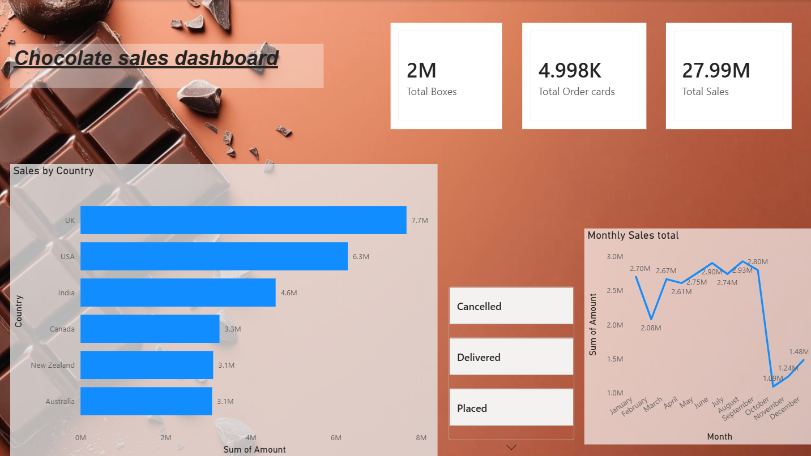

# Chocolete-Sales-Dashboard
Power BI dashboard analyzing chocolate sales, orders, countries, and monthly sales trends.

## Dashboard Overview

The dashboard provides an interactive view of:

- Total Boxes Sold
- Total Order Cards
- Total Sales
- Sales by Country
- Monthly Sales Trends
- Order Status Analysis

## Tools & Technologies

- Power BI
- Microsoft Excel
- Data Visualization
- Data Analysis

## Dashboard Preview

## Key Insights

The dashboard helps identify:

- Countries generating the highest sales.
- Overall sales and order performance.
- Monthly changes in sales.
- Distribution of orders by status.

## Files

- `Chocolate_sale_dashboard.pbix` - Power BI dashboard
- `sample-chocolate-sales-data.xlsx` - Dataset
- `Screenshot_2026-08-14_233625.png` - Dashboard preview

## Project Purpose

This project demonstrates practical skills in data visualization, dashboard design, data analysis, and Power BI reporting.
